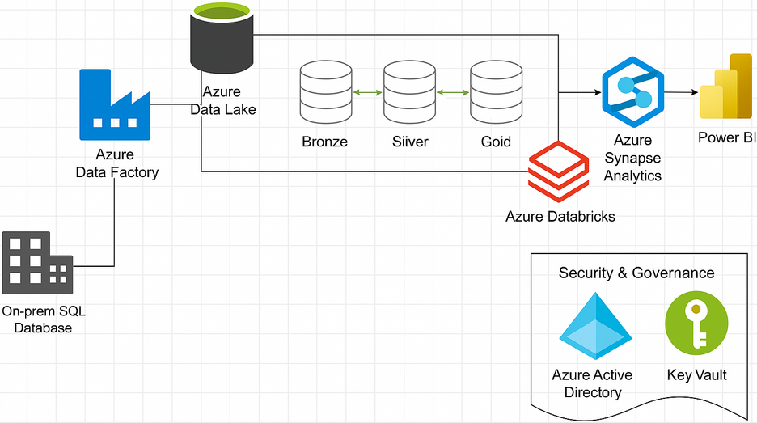

# Microsoft Azure End-To-End Data Engineering Project



# In the Azure Data Factory:


This pipeline segment automates the process of extracting, transforming, and loading data from a source system into a structured data lake environment, following a Bronze-Silver-Gold architecture for data quality and usability. Scheduled to run each day using a trigger, this pipeline ensures that near real-time data is available for front-end applications and reporting purposes.

### Key Components and Flow

1. **Lookup Activity ("Get All Table Names"):**
Initiates the process by querying a source (a database) to retrieve a list of table names. This list is then passed to the ForEach activity.

```sql
SELECT
s.name AS SchemaName,
t.name AS TableName
FROM sys.tables t
INNER JOIN sys.schemas s
ON t.schema_id = s.schema_id
WHERE s.name = 'SalesLT'
```

1. **ForEach Activity ("For Each Table"):**
Iterates through each table name retrieved by the Lookup activity. 

```sql
@activity('Get All Table Names').output.value
```

1. **Copy data Activity ("Copy to ADLS2"):**

For each table, it executes a "Copy to ADLS2" activity (copying the raw data from on-prem SQL database to Azure Data Lake Storage Gen2).

```sql
@concat('SELECT * FROM ', item().SchemaName, '.', item().TableName)
```

1. **Notebook Activity ("Bronze to Silver"):**
Executes an Azure Databricks notebook that transforms the raw data (Bronze layer) into a refined Silver layer format.
2. **Notebook Activity ("Silver to Gold"):**
Executes another Azure Databricks notebook to further transform the Silver layer data into a highly curated Gold layer.

# In the Azure Synapse Analytics:


This segment of the pipeline, executed within Azure Synapse Analytics, focuses on creating and managing views over tables residing in the Gold layer of your data lake. It automates the process of generating views within a server-less SQL pool in Azure Synapse, which can then be used for reporting and querying in tools like Power BI. Unlike the daily-triggered Data Factory pipeline, this Synapse pipeline is designed for on-demand execution. No trigger is set, as it is primarily run on the initial setup to create the views. Subsequently, it is only executed when modifications to the view definitions or schema changes in the Gold layer necessitate updates to the views.

### Key Components and Flow

1. **Get Metadata Activity ("Get Table Names"):**
Retrieves a list of table names from the Gold layer. This activity scans the storage (Azure Data Lake Storage Gen2) to identify the tables that require corresponding views.
2. **ForEach Activity ("For Each Table"):**
Iterates through each table name obtained from the Get Metadata activity. 

```sql
@activity('Get Table Names').output.childItems
```

1. **Stored Procedure Activity ("Stored Procedure Create View"):**

Executes a pre-defined stored procedure. This stored procedure is designed to dynamically create a view based on the current schema of the corresponding Gold layer table.
The view is created within the Azure Synapse server-less SQL pool.

```sql
USE gold_db
GO
CREATE OR ALTER PROC CreateSqlServerlessView_gold @ViewName nvarchar(100)
AS
BEGIN
    DECLARE @statement VARCHAR(MAX)
    SET @statement = N'CREATE OR ALTER VIEW ' + @ViewName + ' AS
    SELECT *
    FROM
        OPENROWSET(
            BULK ''https://your_storage_account_name.dfs.core.windows.net/gold/SalesLT/' + @ViewName + '/'',
            FORMAT = ''DELTA''
        ) AS [result]'    EXEC (@statement)
END
GO
```
